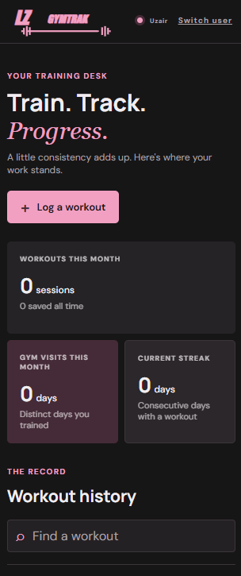

# Lz GYMTRAK

A small, phone-friendly workout log. Start a workout, tap to log each set as you finish it, and see your history, streak and personal records on a dashboard.

It is built with Python, Flask and SQLite, with plain HTML, CSS and JavaScript on the front end. There is no build step and nothing to sign up for: the data lives in a single file on your machine.

<p align="center">
  
</p>

## Features

- **Log set by set.** Add an exercise, set reps and weight with the plus and minus buttons or the number pad, and tap Log set. Each set saves immediately, so nothing is lost if you close the tab mid-workout.
- **Prefilled sets.** The next set starts with the reps and weight from your last one, taken from this workout or the last time you did that exercise.
- **Rest timer.** A 90-second timer starts after every logged set. You can add or subtract 15 seconds, or skip it.
- **Repeat a workout.** Start a new session from one of your three most recent workouts and its exercise list is copied over.
- **A weekly target instead of a daily streak.** Pick how many days a week you want to train. The dashboard shows this week day by day and counts weeks in a row that you hit the target, so rest days never break your streak.
- **This week against last week.** Training days, sets logged and total weight lifted, each compared with the week before.
- **Month calendar.** The current month with your training days filled in.
- **Personal records and trends.** The latest lifts where you beat your previous best, your heaviest lifts ever, and a trend line of best weight per session for the exercises you train most.
- **Searchable history.** Find past workouts by workout name or exercise name.
- **Two profiles, two units.** Each profile has its own history and its own weight unit (kg or lb). Weights are stored in kg and converted for display.
- **Made for phones.** Large tap targets, inputs that don't trigger iOS zoom, and a layout that collapses to one column on small screens. Dark theme only.

## Run it locally

You need Python 3.10 or newer.

```bash
git clone https://github.com/Lz-1000b/gym-progress-tracker.git
cd gym-progress-tracker
python -m venv .venv
```

Activate the virtual environment:

```bash
# macOS / Linux
source .venv/bin/activate

# Windows (PowerShell)
.venv\Scripts\Activate.ps1
```

Install Flask and start the app:

```bash
python -m pip install -r requirements.txt
python app.py
```

Then open <http://127.0.0.1:5000> and pick a profile.

The app creates `gymtrack.db` in the project folder the first time it runs. That file is your workout database. It is ignored by git, so back it up yourself if you want to keep your data.

### Use it from your phone

`python app.py` only accepts connections from the same computer. To reach it from a phone on the same Wi-Fi network, start it with:

```bash
flask run --host 0.0.0.0
```

and open `http://<your-computer's-IP>:5000` on the phone. See the note on security below before doing this on a network you don't trust.

## Configuration

- **Profiles and units.** The profiles are defined at the top of [users.py](users.py) in `USERS` (profile key and display name) and `WEIGHT_UNITS` (`"kg"` or `"lb"` per profile). Edit both to change who uses the app.
- **Session secret.** Set the `SECRET_KEY` environment variable to a random value if the app is reachable by anyone other than you. Without it, a fixed development key is used.

## Project layout

```
app.py          Flask app, config, and every route
db.py           SQLite connection, table creation, schema migration
users.py        Profiles, weight units, kg/lb conversions
workouts.py     Queries for logging and history: search, set prefills, repeats
stats.py        Dashboard numbers: week streak, comparisons, calendar, records, trends
templates/      One HTML file per page
static/         style.css, logo, favicon
```

Routes in `app.py` read and validate the request, then call into `workouts.py` and `stats.py` for data. The front end is hand-written: one stylesheet and inline `<script>` tags, with no CSS or JavaScript framework. The conventions for UI work are in [CLAUDE.md](CLAUDE.md).

### Data model

| Table | Holds |
|---|---|
| `workouts` | Name, date, and which profile it belongs to |
| `workout_exercises` | The exercises in a workout, in order |
| `exercise_sets` | One row per logged set: reps and weight in kg |
| `user_settings` | Each profile's weekly training target |

Databases created by earlier versions of the app, which stored one row per exercise, are migrated to this layout automatically on startup.

## Limitations

- **No authentication.** Picking a profile is a convenience, not a login. Anyone who can reach the app can view and change either profile's data, and there is no CSRF protection. Run it on your own machine or a network you trust.
- **Development server.** `python app.py` runs Flask's development server in debug mode. It is not meant to be exposed to the internet.
- **No automated tests.**
